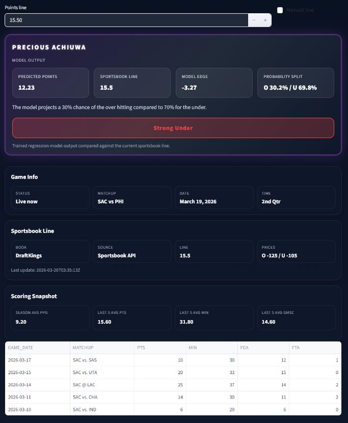

#     NBA Player Performance Prediction

  

  

# NBA Player Performance Prediction

This project uses machine learning to predict NBA player performance and evaluate betting props using real game data.

The focus is on building a practical, data-driven workflow that combines:
- Feature engineering from player game logs
- Regression modeling for stat prediction
- A live web app for real-time prop evaluation

---

## Project Overview

The model predicts player points using historical performance data and rolling statistics.  
It is designed to simulate how a bettor might evaluate over/under lines using recent trends and player role.

The web application allows users to:
- Search any NBA player
- View today’s matchup (if available)
- Input a betting line
- Receive a prediction and probability-based recommendation

---

## Model Details

### Features Used

The current points model is built on a focused, high-signal feature set:

- player_avg_pts → long-term scoring baseline  
- last5_pts → recent scoring trend  
- last5_fga → shot volume (primary driver of points)  
- last5_fta → free throw scoring opportunities  
- last5_minutes → playing time / opportunity  
- last5_gmsc → overall performance metric  

### Model Type

- Gradient Boosting / Random Forest (scikit-learn)
- Trained on NBA game logs via `nba_api`

### Performance

- MAE: ~4.9  
- RMSE: ~6.3  
- R²: ~0.50  

This is considered a solid baseline model for NBA points prediction using public data.

---

## Live Web App

You can use the NBA Points Prop Predictor here:

<a href="https://nbaplayerperformanceprediction-7ajdpm4cmafadrmuczbvyf.streamlit.app/" target="_blank">
Launch Live App
</a>

This interactive app allows users to:
- Search for any NBA player
- View today's matchup (if available)
- Input a betting line
- Get a model-based prediction
- See probability of hitting over/under
- Receive a recommendation (Lean Over / Under / No Edge)
- ### Live Demo

The application is deployed using Streamlit Community Cloud and is publicly accessible.

The app connects to the NBA API in real time to:
- Retrieve player game logs
- Identify today's games
- Generate live predictions

Predictions are converted into probabilities using the model’s error distribution, allowing for more realistic betting-style analysis.

### Example Output

  

